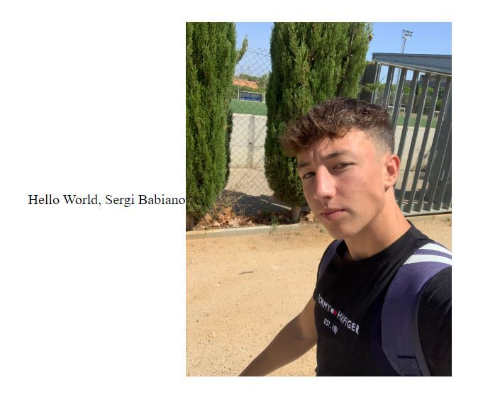

# __Hello World__
Aquesta es la meva pagina web creada desde la aplicació Github. Primer hem creat un arxiu amb un codi html, despres hem posat un codi html dins d'aquest arxiu y vam crear una branca nova per poder pujar la pagina web a internet. Aquest es el resultat. Espero que os agradi. 

| Pasos                                                                                                                                                              |
| ------------------------------------------------------------------------------------------------------------------------------------------------------------------ |
|1.Lo primero que tenemos que hacer es crear un repositorio                                                                                                          |
|2.A continuación, crearemos un nuevo archivo al que introduciremos el codigo html de la acividad de la UF anterior.                                                 |
|3.Seguidamente guardaremos el codigo anterior con la imagen, y pondremos la imagen como objeto                                                                      |
|4.A continuación, crearemos una rama que se llame "gh-pages", para poder publicar nuestra pagian web.                                                               |
|5.Por ultimo, nos iremos a ajustes, y en el apartado de "pages" nos iremos a la opción donde encontramos "visit site", y nos saldra nuestra pagina web correctamente.|
    
            
