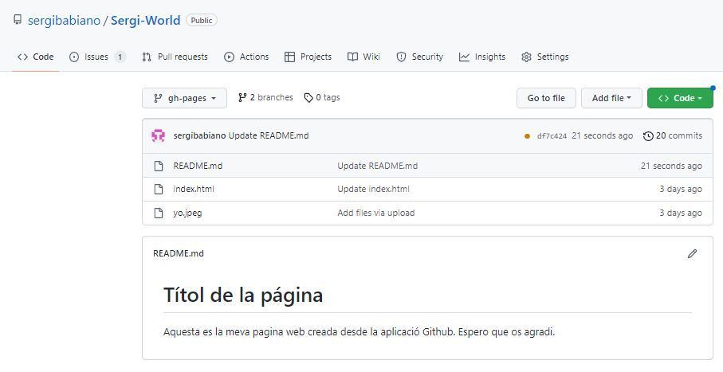

# __Hello World__
Aquesta es la meva pagina web creada desde la aplicació Github. Espero que os agradi.

 |1.Lo primero que tenemos que hacer es crear un repositorio|
 |2.A continuación, crearemos un nuevo archivo al que introduciremos el codigo html de la acividad de la UF anterior.|
 |3.Seguidamente guardaremos el codigo anterior con la imagen, y pondremos la imagen como objeto|
 |4.A continuación, crearemos una rama que se llame "gh-pages", para poder publicar nuestra pagian web.|
 |5.Por ultimo, nos iremos a ajustes, y en el apartado de "pages" nos iremos a la pción donde encontramos "visit site", y nos saldra nuestra pagina web correctamente.|
    
            
